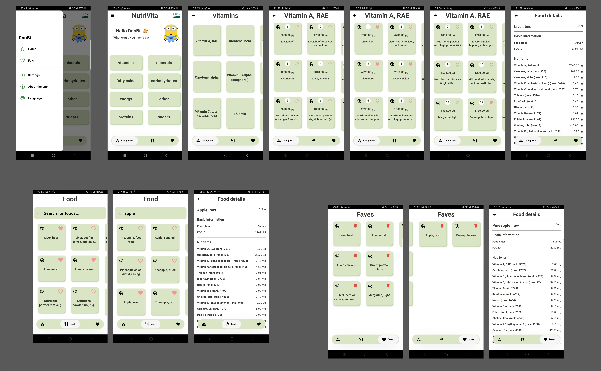
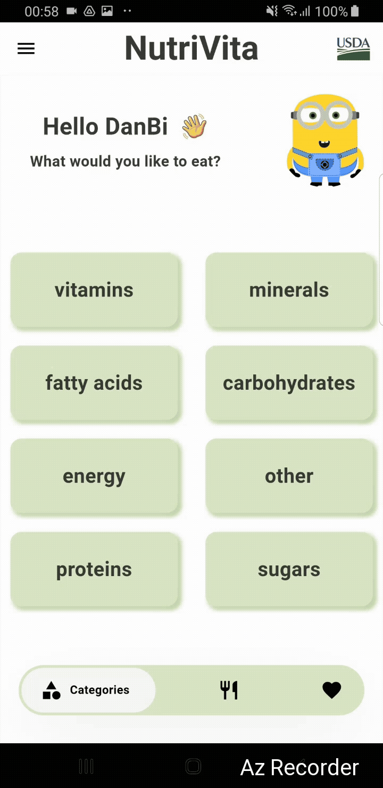

<a href="https://fdc.nal.usda.gov/">
  
</a>


# 🍎 NutriVita

---

## 📘 Project description

NutriVita is a Flutter application designed to **filter food products by nutritional components and search for products by name**.  

The app loads data from JSON files stored in assets, obtained from  **USDA FoodData Central** as Data Type: FNDDS. The main FDC dataset was split into eight JSON files based on predefined categories. The data in each file has been sorted in descending order by the value of the corresponding nutrient to improve search performance.

---

## 🎯 User Stories

### 🧑‍💻 User Type: Health-conscious person

- **As a user**, I want to search for food products by a specific nutrient,  
  **so that** I can quickly check their nutritional values and compare items.

- **As a user**, I want to search for food products by name,  
  **so that** I can quickly check their nutritional values.

- **As a user**, I want to add a selected product to my favorites,
  **so that** I have quick access to the items I use most often.

---

## 🧱 Architecture

The project is based on **Clean Architecture** with a layered code structure. It includes 3 features:

```
/app
├── /di
└── /home
/common
└── /widgets
/config
├── /fonts
└── /theme
/core
├── /database
│   └── /sql
├── /error
├── /key
├── /usecases
└── /utils
/features
├── /categories
│   ├── /data
│   │   ├── /datasources
│   │   ├── /models
│   │   └── /repositories
│   ├── /domain
│   │   ├── /entities
│   │   ├── /repositories
│   │   └── /usecases
│   └── /presentation
│       ├── /bloc
│       ├── /pages
│       │   └── /components
│       └── /widgets
│           ├── /category_group
│           ├── /foods_by_group
│           └── /number_group
├── /faves
│   ├── /data
│   │   ├── /datasources
│   │   └── /repository
│   ├── /domain
│   │   ├── /repositories
│   │   └── /usecases
│   └── /presentation
│       ├── /bloc
│       ├── /pages
│       └── /widgets
├── /foods
│   ├── /data
│   │   ├── /models
│   │   └── /repositories
│   ├── /domain
│   │   ├── /entities
│   │   ├── /repositories
│   │   └── /usecases
│   └── /presentation
│       ├── /bloc
│       ├── /pages
│       └── /widgets
└── /settings
    └── /widgets
/i18n
```

---

## Features

 - **Categories**
   - Provides 8 nutrient-based categories
   - Data sorted in descending order for better performance
   - Supports filtering by category

 - **Faves**
   - Allows users to save products to favorites
   - Uses a local SQLite database
   - Provides quick access to saved items

 - **Foods**
   - Allows searching for products by name


---

## Tech Stack

- Flutter (Dart)
- Architecture: BLoC + Clean Architecture
- Dependency Injection: get_it
- sqflite (local DB)
- Functional helpers: dartz
- slang

---


## 🖼️ Screenshots

<p align="center">
  
</p>

<p align="center">
  
</p>

## 🎬 App Demo

[📥 Download MP4](assets/demo.mp4)


